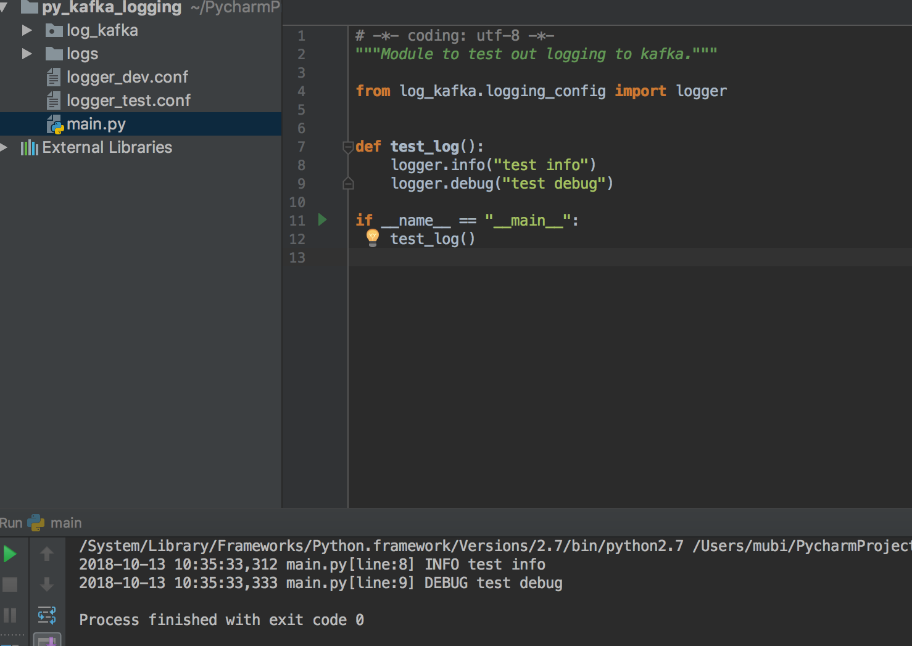
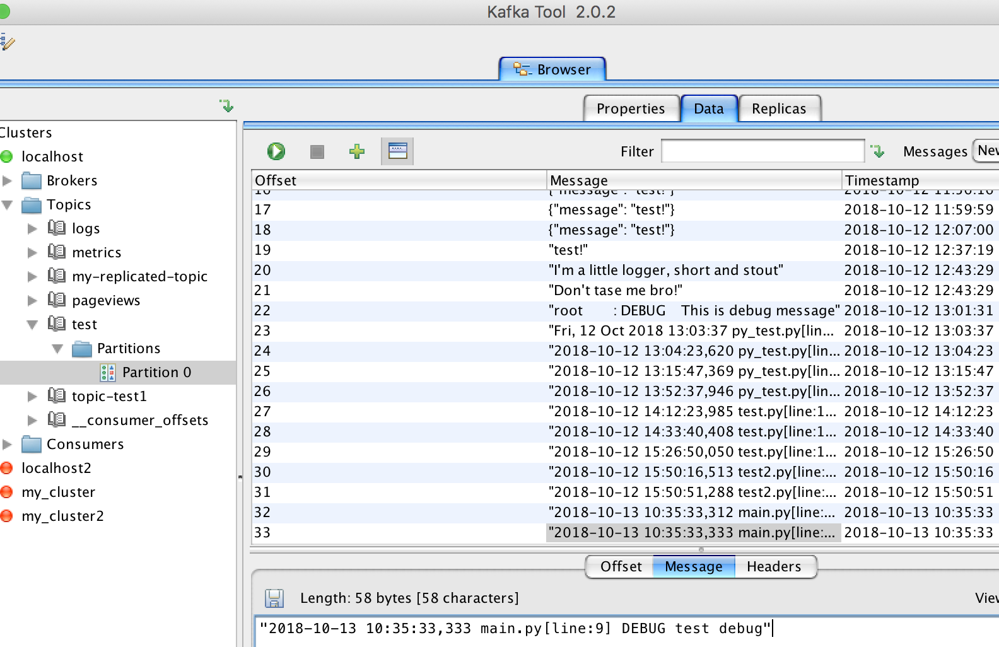

实现python `logging`写到`kafka`，可直接运行`main.py`

---

## python 模块

* kafka-python

* logging

## 运行结果

## 参考

[stackoverflow](https://stackoverflow.com/questions/21102293/how-to-write-to-kafka-from-python-logging-module)

[网络博文](http://xiaorui.cc/2015/06/14/%E4%BD%BF%E7%94%A8kafka%E6%89%A9%E5%B1%95python-logging%E9%9B%86%E4%B8%AD%E5%BC%8F%E6%97%A5%E5%BF%97%E6%94%B6%E9%9B%86/)

[python-kafka-logging](https://github.com/taykey/python-kafka-logging)